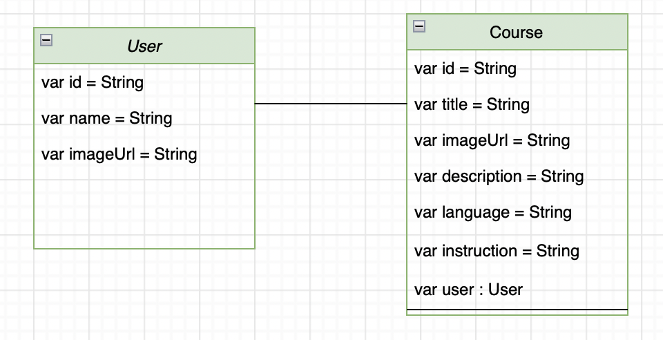

# BeCoding

## Description
- An Educational application to teach programming and benefit from the experiences of programmers and developers to provide programming lessons

## Demo

## user Stories 

## Framework
- UIKit
- Firebase
- Foundation
- IQKeyboardManagerSwift

## ERD

## Wireframe

